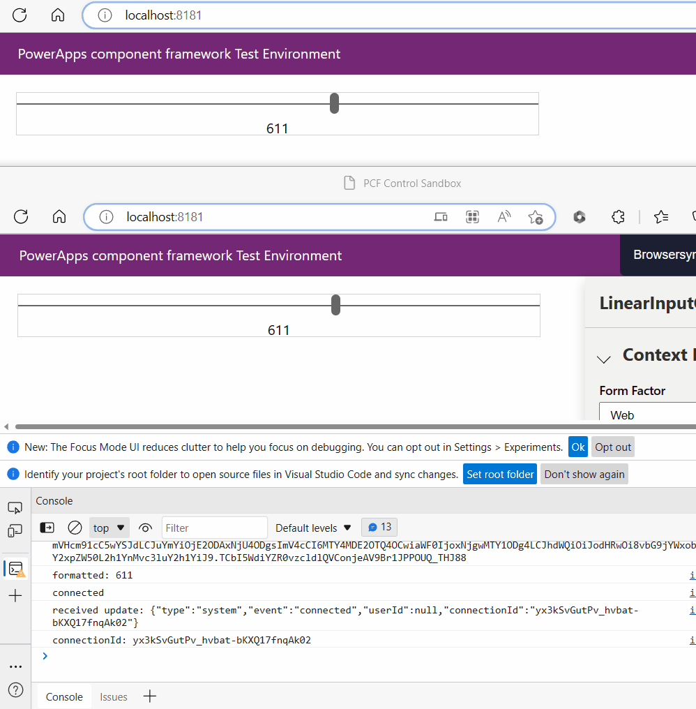

# pcf-web-pubsub-sample

## Steps

1. Check [Create your first component](https://learn.microsoft.com/en-us/power-apps/developer/component-framework/overview) to set up the environment and run the app locally.

2. Update the `APHelper.cs` under project __FunctionPA__ to set the Web PubSub connection string.

3. Run `func start` under project __FunctionPA__ to start the function app which helps negotiate and build the web pubsub websocket url.

4. Run `npm start watch` under project __PowerAppLinerInput__ to start the power app.

5. Update the switch value in line 42 of file `PowerAppLinerInput\LinerInputControl\index.ts` to turn on/off the Web PubSub connection. You'll be able to see the instance updates when the value is `true` in 2 different local app windows.

